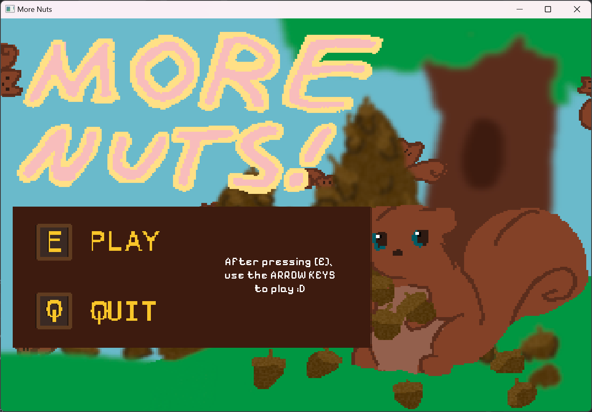
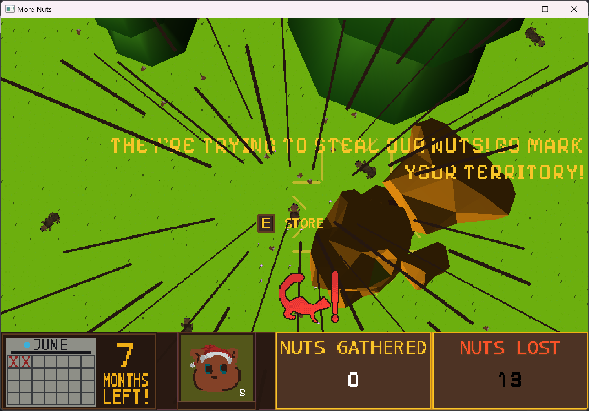
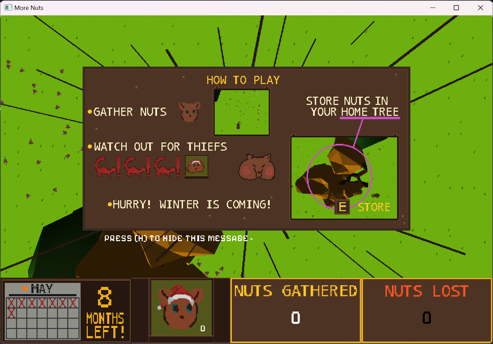

# More Nuts

A top-down, 2D game where you play a squirrel trying to gather as much nuts 
as possible before winter. Made (but not completed in time) for [Mini Jam 174](https://github.com/jesselawson/more-nuts). 

The theme was "Defense" and the condition was "only one resource."

## Screenshots

## How to play

Use the arrow keys to collect nuts, then head back to your home tree and deposit them for the winter. 
Other squirrels will try to steal your nuts, so you'll have to go back and run around your home tree 
to ward them off. 

## What's in the repo

- All of the Lua code I wrote to quickly scaffold this game
- A fully working game with a start screen, play screen, and scoring screen 
- All assets were created by me in Aseprite except for the tree meshes
- Sounds were done in-house except for a few that were random ones I found
in my sounds folder

## For educational purposes only

You're free to use this code for educational purposes, but this code is not for 
production use nor is it meant to be illustrative of production-ready code. This 
codebase is for a game that was intentionally built as fast as possible, so while 
the game is functional, the codebase requires significant refactoring because
there were many decisions made under time pressure.

